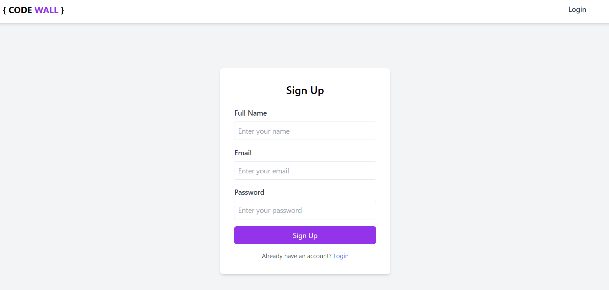
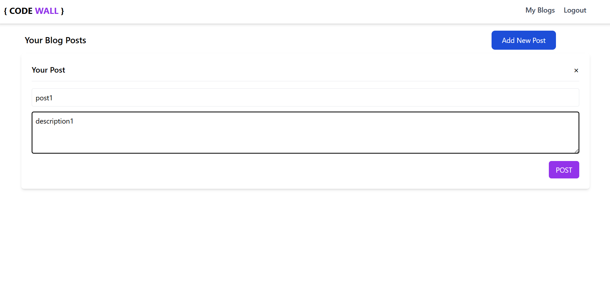
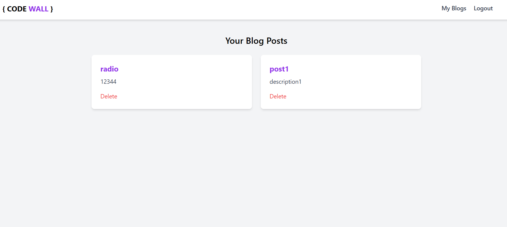

# atelier POO en JavaScript

Ce atelier regroupe une série d'exercices pratiques pour se familiariser avec la Programmation Orientée Objet (POO) en JavaScript, en mettant en œuvre des concepts tels que l'héritage et la gestion des objets.

## 📌 Contenu d'atelier

### Exercice 1 : Gestion des Voitures 🚗
- Création d'une fonction constructeur `Voiture` avec les attributs : modèle, marque, année, type, carburant.
- Création d'une liste de voitures.
- Implémentation de l'héritage avec les classes `Hyundai` et `Ford`.
- Tri et affichage des voitures par année (ordre croissant).
- **Fichier** : `exercice1.js`

### Exercice 2 : Gestion des Étudiants et Professeurs 🎓
- Création des objets `Etudiant` et `Professeur`.
- Méthodes : `etudier()` et `enseigner()`.
- Tri des étudiants par ordre alphabétique (nom, prénom).
- **Fichier** : `exercice2.js`

### Exercice 3 : Manipulation de classes en ES6 🔢
- Définition de la classe `Vecteur2D` avec addition et affichage.
- Création de la classe `Rectangle` et de sa classe dérivée `Carre`.
- Définition de la classe `Point` et de la classe `Segment`.
- **Fichier** : `exercice3.js`

### Exercice 4 : Mini-Blog en JavaScript 📝
## Objectif

L'objectif de cet exercice est de créer un mini-blog utilisant la programmation orientée objet (POO) en JavaScript. Il permet aux utilisateurs de s'inscrire, se connecter, ajouter des publications, et afficher les publications. Les données sont stockées dans le `localStorage`.

## Fonctionnalités

1. **Inscription et Connexion des Utilisateurs :**
   - **Inscription :** Les utilisateurs peuvent s'inscrire en remplissant leur nom, email et mot de passe. L'inscription est réalisée sur la page `signing.html`.
   - **Connexion :** Les utilisateurs peuvent se connecter avec leur email et mot de passe sur la page `login.html`.

2. **Création et Gestion des Publications :**
   - **Ajouter une publication :** Les utilisateurs connectés peuvent ajouter de nouvelles publications avec un titre, une description.
   - **Afficher les publications :** Les publications créées par chaque utilisateur sont affichées sur la page `blogs.html`.
   - **Supprimer une publication :** Les utilisateurs peuvent supprimer leurs publications.

## Fichiers:

- **`login.html`** : Page de connexion où les utilisateurs peuvent se connecter avec leur email et mot de passe.
- **`signing.html`** : Page d'inscription où les utilisateurs peuvent créer un compte.
- **`index.html`** : Page principale qui permet l'ajout de nouvelles publications.
- **`blogs.html`** : Affichage des publications créées par l'utilisateur connecté.
- **`blogs.js`** : Contient la logique pour l'ajout, l'affichage et la suppression des publications.
- **`signing.js`** : Gestion de l'inscription des nouveaux utilisateurs.
- **`login.js`** : Gestion de la connexion des utilisateurs.


####  Captures d'écran : 📸

1. **Page de Login :**  
   Cette page permet aux utilisateurs de se connecter en utilisant leur adresse email et leur mot de passe.  
   

2. **Page d'Inscription :**  
   Les utilisateurs peuvent s'inscrire en remplissant un formulaire avec leur nom, email et mot de passe.  
   

3. **Page Principale pour Ajouter un Post :**  
   Sur cette page, l'utilisateur peut ajouter une nouvelle publication en renseignant un titre, une description .
   
    

4. **Page pour Voir les Posts :**  
   Cette page affiche toutes les publications créées par l'utilisateur connecté.
   


## 🚀 Installation et Utilisation

Pour cloner et exécuter le projet localement :

1. Cloner le projet avec la commande suivante :
   ```bash
   git clone https://github.com/ahyahya1616/poo-Class-tasks.git
